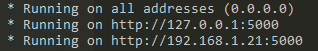

# Little audio master controller from web interface for Windows


## Installation

```bash
pip install -r requirements.txt
```

## Launch web server

```bash
flask run --host=0.0.0.0
```



Then, you can control the audio master level from any device which is from the same network by accessing the ip address provided by the server startup script.